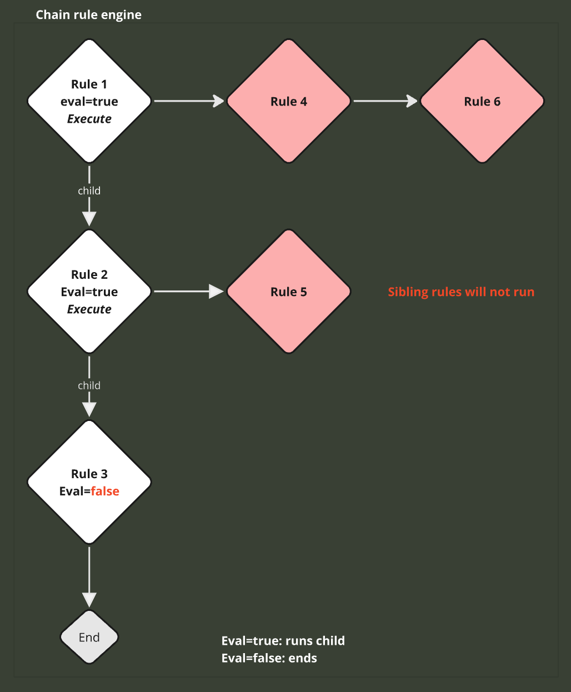
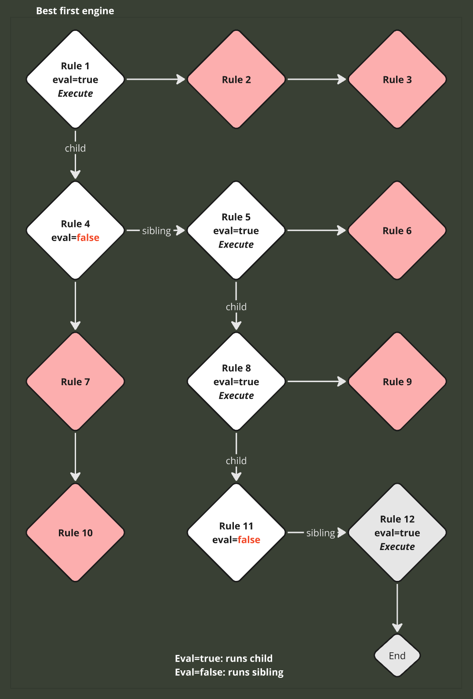

# dredd-go

This is a port of [Dredd](https://github.com/amsterdatech/Dredd) rules engine to Go

## Dredd Rules Engine

*From the original:*

> Dredd was created to be a simple way to detach application business logic in order to create a decision tree model best for visualize and perhaps easy to understand and maintain.

---

## Chain Rule Runner 

When using the `ChainRuleRunner`, the rules will be executed in a linear sequence. When the `OnEval()` of a rule returns true, its child rule will be evaluated, continuing until there are no more child rules.



## Best First Rule Runner

When using the `BestFirstRuleRunner`, the rules will be executed so that if `OnEval()` returns true, the first child rule will be evaluated. If `OnEval()` returns false, the next sibling rule will be evaluated until there are no more child or sibling rules.



## Rules

Here are the available methods for setting up your rules:

### Simple API (recommended for most use cases):
- `OnEval(func(Context[T]) bool)` - Sets the condition that determines whether the rule should execute
- `OnExecute(func(Context[T]))` - Contains the main code the rule should execute  
- `OnPreExecute(func(Context[T]))` - Any actions the rule needs to perform beforehand
- `OnPostExecute(func(Context[T]))` - Any actions the rule should perform afterward
- `AddChildren(...*BaseRule[T,C]) error` - Add child rules with validation

### Advanced API (with error handling):
- `OnEvalWithError(func(Context[T]) EvaluationResult)` - Evaluation with error control
- `OnExecuteWithError(func(Context[T]) ExecutionResult)` - Execution with error control
- `OnPreExecuteWithError(func(Context[T]) ExecutionResult)` - Pre-execution with error control
- `OnPostExecuteWithError(func(Context[T]) ExecutionResult)` - Post-execution with error control

### Runner Functions:
- `ChainRuleRunner(ruleContext, rules...)` - Simple execution
- `ChainRuleRunnerWithContext(goCtx, ruleContext, rules...)` - With Go context support
- `BestFirstRuleRunner(ruleContext, rules...)` - Simple execution
- `BestFirstRuleRunnerWithContext(goCtx, ruleContext, rules...)` - With Go context support
  
*Notes:*

* You don't need to provide all the callbacks
* Additionally, you should pass a `RuleContext` during execution, which is a map accessible from within the rules. 
* You can even mix runners and call another runner within the execution of a rule, using a new sequence of different rules from any type.

## Example

```go
import "github.com/leoslamas/dredd-go/rule"

func main() {
	var rule1 = rule.NewChainRule[bool]()
	var rule2 = rule.NewChainRule[bool]()

	rule1.OnEval(func(ctx rule.Context[bool]) bool {
		println("Eval Chain Rule 1")
		value, exists := ctx.GetRuleContext().Get("value")
		return exists && value

	}).OnPreExecute(func(ctx rule.Context[bool]) {
		println("Pre Chain Rule 1")

	}).OnExecute(func(ctx rule.Context[bool]) {
		println("Execute Chain Rule 1")

	}).OnPostExecute(func(ctx rule.Context[bool]) {
		println("Post Chain Rule 1")
	})

	rule2.OnEval(func(ctx rule.Context[bool]) bool {
		println("Eval Chain Rule 2")
		return false

	}).OnExecute(func(ctx rule.Context[bool]) {
		println("Execute Chain Rule 2") // unreachable
	})

	_ = rule1.AddChildren(rule2.BaseRule)

	var ruleContext = rule.NewRuleContext[bool]()
	ruleContext.Set("value", true)

	_ = rule.ChainRuleRunner(ruleContext, rule1.BaseRule)
}
```

Result:

```
> Eval Chain Rule 1
> Pre Chain Rule 1
> Execute Chain Rule 1
> Post Chain Rule 1
> Eval Chain Rule 2
```

## Advanced Examples

### Error Handling with Advanced API

```go
rule := rule.NewChainRule[string]()

// Using advanced API with error handling
rule.OnEvalWithError(func(ctx rule.Context[string]) rule.EvaluationResult {
    value, exists := ctx.GetRuleContext().Get("condition")
    if !exists {
        return rule.EvaluationResult{
            ShouldExecute: false,
            Error:         errors.New("missing condition"),
        }
    }
    return rule.EvaluationResult{ShouldExecute: value == "proceed", Error: nil}
}).OnExecuteWithError(func(ctx rule.Context[string]) rule.ExecutionResult {
    // Complex logic that might fail
    if err := performComplexOperation(); err != nil {
        return rule.ExecutionResult{Error: err}
    }
    ctx.GetRuleContext().Set("result", "success")
    return rule.ExecutionResult{Error: nil}
})

ruleContext := rule.NewRuleContext[string]()
ruleContext.Set("condition", "proceed")

if err := rule.ChainRuleRunner(ruleContext, rule.BaseRule); err != nil {
    log.Printf("Rule execution failed: %v", err)
}
```

### Context Cancellation and Timeouts

```go
// Using context with timeout
ctx, cancel := context.WithTimeout(context.Background(), 5*time.Second)
defer cancel()

ruleContext := rule.NewRuleContext[int]()
err := rule.ChainRuleRunnerWithContext(ctx, ruleContext, myRule.BaseRule)
if err != nil {
    if errors.Is(err, context.DeadlineExceeded) {
        log.Println("Rule execution timed out")
    } else {
        log.Printf("Rule execution failed: %v", err)
    }
}
```

### Functional Options (Alternative Configuration)

```go
// Using functional options for complex rule setup
rule := rule.NewChainRuleWithOptions[int](
    rule.WithEvaluation[rule.ChainRule[int], int](func(ctx rule.Context[int]) bool {
        count, exists := ctx.GetRuleContext().Get("count")
        return exists && count > 0
    }),
    rule.WithExecution[rule.ChainRule[int], int](func(ctx rule.Context[int]) {
        count, _ := ctx.GetRuleContext().Get("count")
        ctx.GetRuleContext().Set("result", count*2)
    }),
)
```

## Todo

- [ ] Async rules

---

# License #

    Copyright 2015 Amsterda Technology, Inc.

    Licensed under the Apache License, Version 2.0 (the "License");
    you may not use this file except in compliance with the License.
    You may obtain a copy of the License at

       http://www.apache.org/licenses/LICENSE-2.0

    Unless required by applicable law or agreed to in writing, software
    distributed under the License is distributed on an "AS IS" BASIS,
    WITHOUT WARRANTIES OR CONDITIONS OF ANY KIND, either express or implied.
    See the License for the specific language governing permissions and
    limitations under the License.